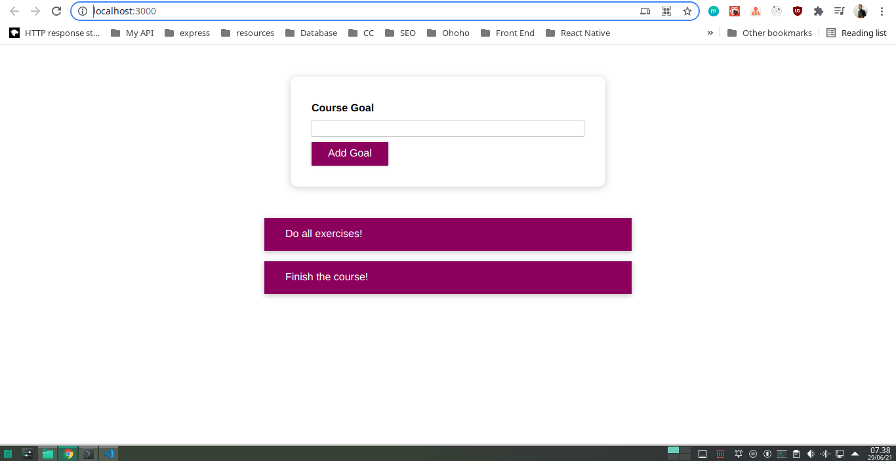

# About Project

React Goasl List is a react app tha i create to learn some styling option in react.

In this project i learn how to use some styling option in react. there are 3 options that i learn in this project. first, its normal css, then i learn how to use styled components include media query, and last i learn how to use CSS modules in this project.
Absolutely, I've already use css modules on some of my project, but In this project I am diving deeper to learn more styles option in react.

## How to install

1. Clone this project

```sh
git clone https://github.com/sipamungkas/react-goals-list
```

2. Go Project Directory

```sh
cd react-goals-list
```

3. Install Dependencies

NPM

```sh
npm install
```

or

Yarn

```sh
yarn install
```

4. Run Project

NPM

```sh
npm start
```

or

Yarn

```sh
yarn start
```

5. Open Browser type this 'localhost:3000' on address bar

## Screenshot


